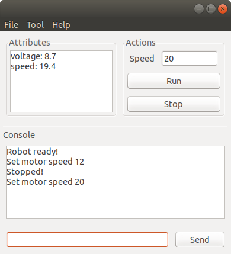

# Robot Monitor
In programming an MCU for robots, it is usually needed to what how the data input and output are going on. In the example of a line following robot, IR sensor input values and PID controller output value are displayed by means of text or graph. **Robot Monitor** is a visualization tool written in **C++**. The **Robot Monitor** software make it possible to use CLI-like interface, custom GUI for machine control, graphing and 3D visualization.

</img>

In case of debugging a particular system, UI widgets can replace the circuits of buttons, switches and potentiometers. Compared with traditional consoles, attributes, graphs and logs are separated. The GUI components are of **WxWidgets** library.